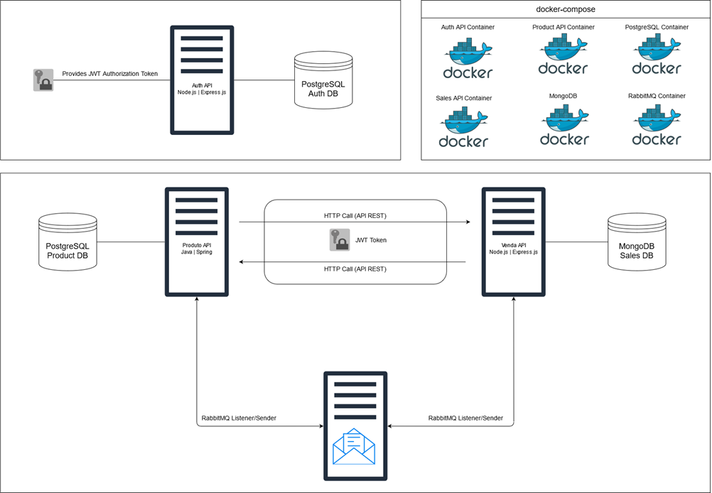

# Projeto Microserviços

Arquitetura do projeto é a seguinte:

O projeto possui 3 APIs:

* **Auth-API**: API de Autenticação com Node.js 21, Express.js, Sequelize, PostgreSQL, JWT e Bcrypt.
* **Sales-API**: API de Vendas com Node.js 21, Express.js, MongoDB, Mongoose, validação de JWT, RabbitMQ e Axios para clients HTTP.
* **Product-API**: API de Produtos com Java 17, Spring Boot, Spring Data JPA, PostgreSQL, validação de JWT, RabbitMQ e Spring Cloud OpenFeign para clients HTTP.

A arquitetura rodando em containers docker via docker-compose.

### Fluxo de execução de um pedido

O fluxo para realização de um pedido irá depender de comunicações **síncronas** (chamadas HTTP via REST) e **assíncronas** (mensageria com RabbitMQ).

O fluxo está descrito abaixo:

* 01 - **Início do Fluxo**: Uma requisição é feita ao endpoint de criação de pedido.
* 02 - **Payload de Entrada**: O JSON de entrada contém uma lista de produtos com seus respectivos IDs e quantidades desejadas.
* 03 - **Validação de Estoque**: Antes de criar o pedido, é realizada uma chamada REST à API de produtos para verificar se há estoque suficiente para todos os produtos.
* 04 - **Erro de Estoque Insuficiente**: Se algum produto não tiver estoque disponível, a API de produtos retorna um erro, e a API de vendas lança uma mensagem informando a falta de estoque.
* 05 - **Criação do Pedido**: Se houver estoque disponível, um pedido é criado e salvo no MongoDB com status "PENDING".
* 06 - **Publicação no RabbitMQ**: Ao salvar o pedido, uma mensagem é publicada no RabbitMQ contendo o ID do pedido criado e os produtos com seus respectivos IDs e quantidades.
* 07 - **Recebimento da Mensagem pela API de Produtos**: A API de produtos, que está ouvindo a fila, recebe a mensagem.
* 08 - **Revalidação do Estoque**: Ao receber a mensagem, a API revalida o estoque dos produtos e, caso todos estejam disponíveis, atualiza o estoque de cada um.
* 09 - **Atualização de Estoque Bem-Sucedida**: Se a atualização do estoque for bem-sucedida, a API de produtos publica uma mensagem na fila de confirmação de vendas com status "APPROVED".
* 10 - **Falha na Atualização de Estoque**: Se houver algum problema na atualização, a API de produtos publica uma mensagem na fila de confirmação de vendas com status "REJECTED".
* 11 - **Atualização do Pedido**: A API de pedidos recebe a mensagem de confirmação e atualiza o status do pedido com base na mensagem recebida.

